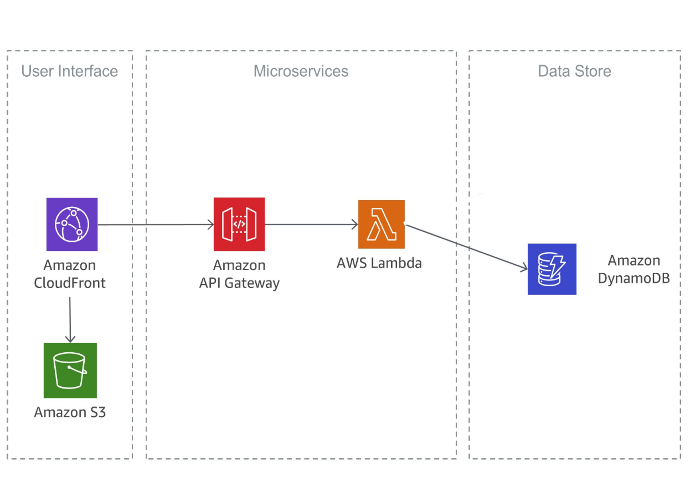
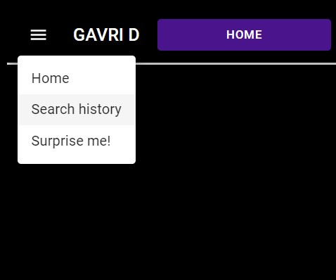

# Gavri Dictionary App  

link to official site via s3 and cloud front: [Gavri dictionary](https://d3iwjb8npp9uhz.cloudfront.net/)

## Intro

<!-- Gavri Dictionary is an application consisting of a range of services to help you, the user, use an online easy to use and reliable dictionary. Much like a regular old paper dictionary, Gavri dictionary can be used to look up words and there minings, but it can do much more! -->

This project is a cloud based dictionary application based on the AWS Cloud. The application consists of multiple micro services working together in since, with the
Microservices Architecture mindset. Feel free to check out the project [road map](#road-map) at the bottom of the page, where you'll find project future goals.

## Table of contents

1. [Back-end](#back-end)
2. [Services and Build](#services)
3. [Structure](#structure)
4. [Tests](#tests)
5. [CI/CD - Github Actions](#ci/cd)
6. [Api](#api)
7. [Front-end](#front-end)
8. [Build](#build-front)
9. [Use cases](#use-cases)
10. [Road map](#road-map)

<!-- ## About the project

This project was made as an exercise for learning cloud infrastructure in aws aka amazon web services. The contents of this repo include the back-end and the front-end of the app. -->

# Back-end

## Services and Build

### DynamoDB - dictionary-table

A noSQL db created for storing the dictionary words definitions

How did I insert all the 100,000+ words present?

I found the best solution is not to insert every word from my desktop computer, but rather create a separate system for word insertion. I created an S3 bucket for storing json files that, on insertion, triggers a Lambda, named "ingest", that loops throw the json, ingesting each word and uploading it in the correct format to `dictionary-table`.
At the moment the system is not in production state and I plan on <b>making it fully integrated</b> soon. [road map](#road-map)

### Serverless - Api-Gateway, express Lambda and DynamoDB

The Api-Gateway allows to invoke the express Lambda with the current request. The Lambda is responsible for handling that request accordingly.

This is the main back-end api. It is built using the [Serverless Framework](https://www.serverless.com/).

### Cloud-Front

The front-end part of the app is served by an S3 bucket.
In order to get the added benefit of using SSL and https and more I added the CloudFront service. There are more benefits for using that method which i won't mention here.

## Structure

## Tests

For integration testing in the back I use jest and supertest.
I opt to use the Cypress library for my e2e testing.

Back: to run enter: `npm run dev` and after the serverless offline is initialized run `npm test`

API tests

- add and get word from db
  - :white_check_mark: add word
  - :white_check_mark: get word
  - :white_check_mark: word are returned as json
- word router
  - :white_check_mark: GET /word/:word
- GET /word/:word/:partOfSpeech - get word with a specific partOfSpeech
  - :white_check_mark: get a noun
  - :white_check_mark: get a verb

Front: to run the tests you can enter: `npm run cy:run` - for headless or `npx cypress open` - for full debug mode.

Word search

- :white_check_mark: using appBar search bar
- :white_check_mark: using bottom of page search bar
- :white_check_mark: traversing throw words links

AppBar buttons test

- :white_check_mark: home button returns home
- :white_check_mark: history button goes to history

## CI/CD - Github Actions

At the moment I have set up a pipeline for the front-end

### CI - Tests

Every push or pull request triggers a github action workflow which runs the cypress e2e tests. <b>A pull request that did not pass the test will not be able to be merged into the main branch</b> and trigger the push CD workflow. see [Managing a branch protection rule](https://docs.github.com/en/repositories/configuring-branches-and-merges-in-your-repository/defining-the-mergeability-of-pull-requests/managing-a-branch-protection-rule)

### CD - Deployment

<b>Only a push to the main branch</b> will trigger a github workflow which builds and deploys the react front build to the S3 bucket. <b>The workflow also invalidates the CloudFront distribution</b> in order to make cloud front to re fetch the latest version of the build.

## Api

- GET /word/:word - get the definition of a word
- GET /word/:word/:partOfSpeech - get the word definition filter by part of speech
- GET partOfSpeech/:part - get random word withe a spacific part of speech

# Front-end

## Build

This project was build using the following technologies:

1.  React.js and MUI
2.  react router
3.  react query
4.  js, css, html
5.  aws s3 storage
6.  cloud front aws service

## Use cases

- Mobile compatible!
  the front end was designed in the mobile first methodology.
- Search word:

  From the home screen, you have 2 ways to search for a word.

  1. use the upper right corner search bar input
  2. use the search input at the bottom of the page
  3. press Enter, and off you go!
  <!--  -->

- Search history

  1. press the search history button at the app bar

  <!--  -->

- Each word is a link. Try it!

## Road map

Here I state what are my next goals.

By order of importance:

- finish word upload system using cdk
- integrate the system in the front end
- complete 100% test coverage
- convert all code base to TypeScript

## License

:copyright: Gavriel Frant
