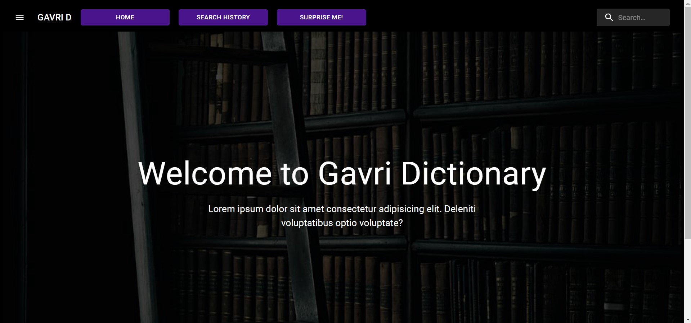
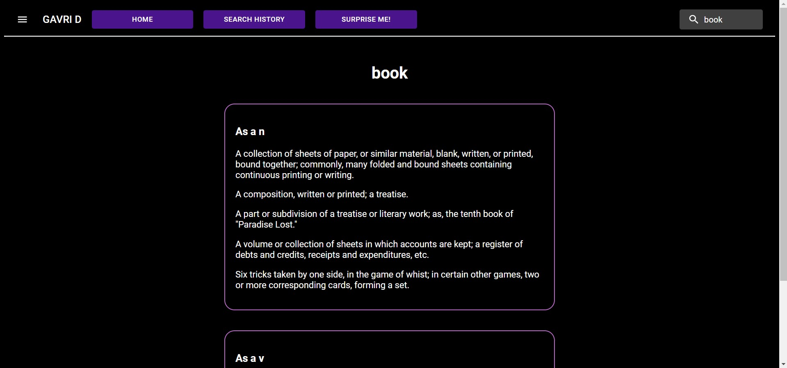

# Gavri Dictionary App

link to official site via s3 and cloud front: [Gavri dictonari](https://d3iwjb8npp9uhz.cloudfront.net/)

## Intro

Gavri Dictionary is an application consisting of a range of services to help you, the user, use an online easy to use and reliable dictionary. Much like a regular old paper dictionary, Gavri dictionary can be used to look up words and there minings, but it can do much more!

## Table of contents

1. [About the project](#motivation)
2. [Build](#build)
3. [Use cases](#more-than-embedded)

## About the project

This project was made as an exercise for learning cloud infrastructure in aws aka amazon web services. In this repo only the front part of the app is present.
To see the back off the app and more info about the architecture see: [back-end](https://github.com/gavriel44/aws-dictionary-back-end/tree/develop)

## Build

This project was build using the following technologies:

1.  React.js
2.  react router
3.  js, css, html
4.  aws s3 storage
5.  cloud formation aws service

## Use cases

- Mobile compatible!
  the front end was designed in the mobile first metodologi.
- Search word:

  From the home screen, you have 2 ways to search for a word.

  1. use the upper right corner search bar input
  2. use the search input at the bottom of the page

  

  3. press Enter, and off you go!

  

- Search history
  1. press the search history button at the app bar
- Easy to use menu

  
